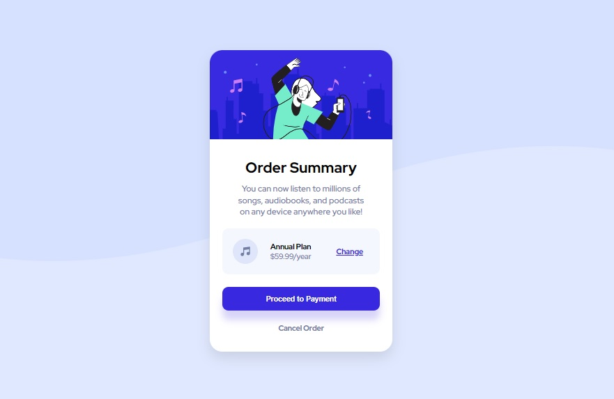

# Frontend Mentor - Order summary card solution

This is a solution to the [Order summary card challenge on Frontend Mentor](https://www.frontendmentor.io/challenges/order-summary-component-QlPmajDUj). Frontend Mentor challenges help you improve your coding skills by building realistic projects. 

## Table of contents

- [Overview](#overview)
  - [The challenge](#the-challenge)
  - [Screenshot](#screenshot)
  - [Links](#links)
- [My process](#my-process)
  - [Built with](#built-with)
  - [What I learned](#what-i-learned)
- [Author](#author)
- [Acknowledgments](#Acknowledgments)


## Overview

### The challenge

Users should be able to:

- See hover states for interactive elements

### Screenshot




### Links

- Solution URL: [My solution URL](https://www.frontendmentor.io/solutions/order-summary-component-O2y7OsVYg)
- Live Site URL: [My live site URL](https://mehdi-adham.github.io/order-summary-component/)

## My process

### Built with

- Semantic HTML5 markup
- CSS custom properties
- Flexbox


### What I learned

I'm use screen media.

```css
@media screen and (min-width: 768px) {
  body {
    background:var(--Pale-blue) url(images/pattern-background-desktop.svg) no-repeat;
    background-size: 100%;
  }
}
@media screen and (max-width: 768px){
    body {
        background: var(--Pale-blue) url(images/pattern-background-mobile.svg) no-repeat;
        background-size: 100%;
    }
}
```

## Author

- Website - [Mehdi Adham](https://github.com/mehdi-adham)
- Frontend Mentor - [@mehdi-adham](https://www.frontendmentor.io/profile/mehdi-adham)


## Acknowledgments

Thanks so much to anyone providing feedback on my [solution](https://www.frontendmentor.io/solutions/order-summary-component-O2y7OsVYg). It definitely helps to find new ways to code and find easier solutions!